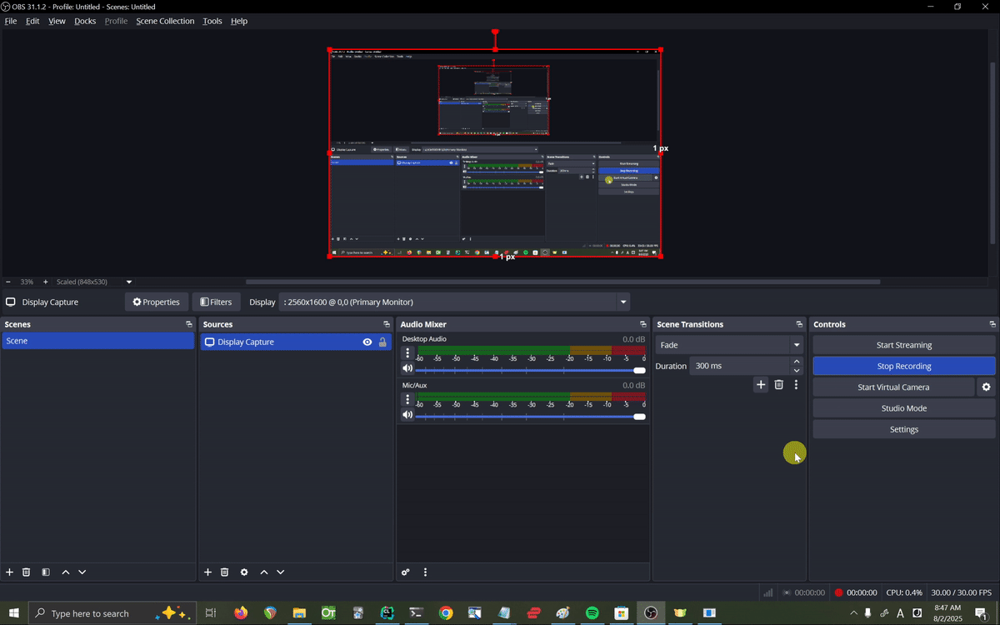
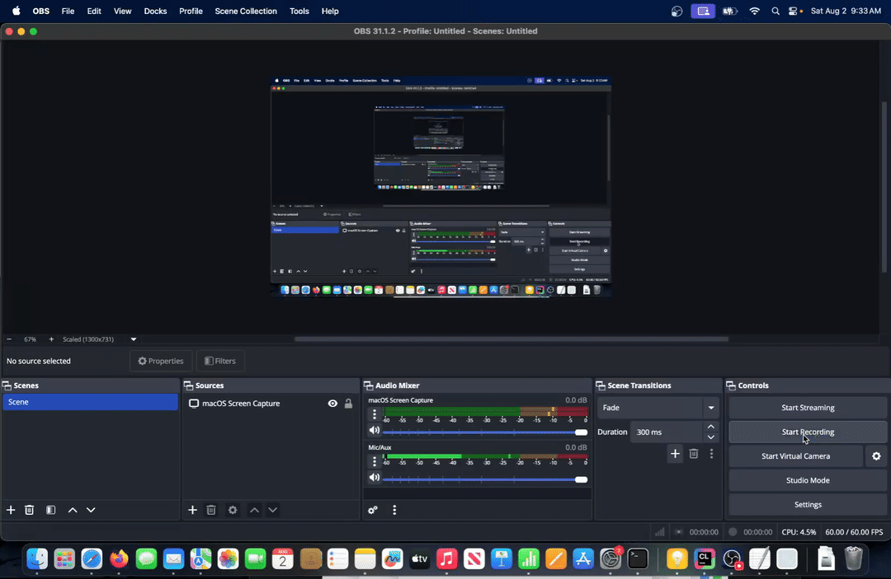
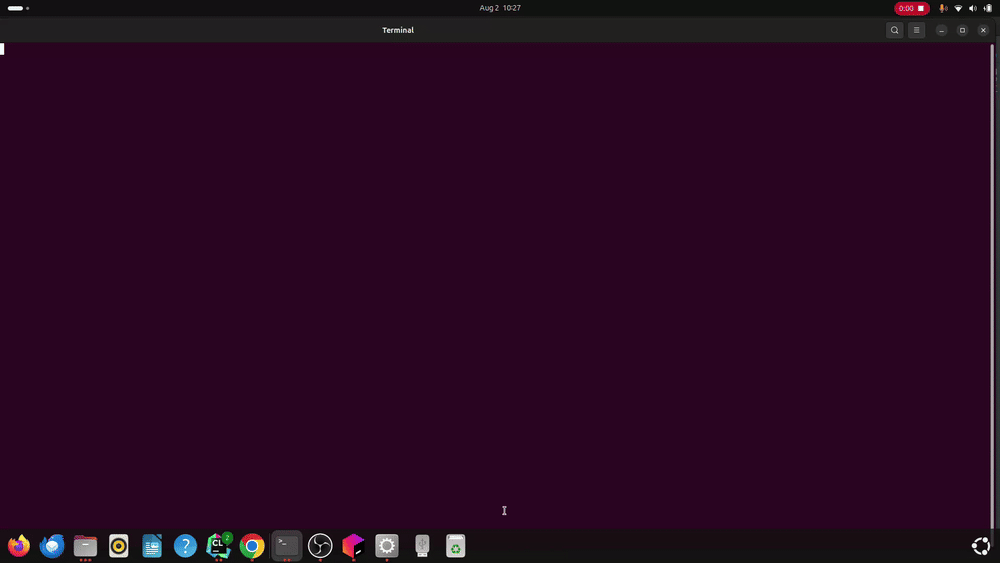

# Floating child windows
This fork adds support for child windows that float on top of their parent, but not the rest of the desktop  
Supports Windows, macOS, and Linux  
More technically speaking, it provides an abstraction over win32 owner/owned windows, cocoa child windows,
and X11 transient windows (or whatever you call windows that you've called `XSetTransientFor` on)
## Gifs
### Windows

### macOS

### Linux
  
The demo project shown in these gifs can be found [here](https://github.com/original-picture/juce-child-peers-test-app)

## API overview
The main function of interest is `ComponentPeer::addFloatingChildPeer (ComponentPeer* child, int zOrder = -1);`  
Calling this on a `ComponentPeer` with another `ComponentPeer` `child` will make `child` always float above it. 
On platforms that don't support child peers (Android, iOS), it returns false. Otherwise, it returns true  
There are also several utility functions in `ComponentPeer`, like `ComponentPeer* ComponentPeer::getFloatingChildPeerParent()`, for querying information about parent/child peers  
I've tried to make the API similar to the child *component* API so that it's familiar to users

> [!NOTE]
> floating child windows will still appear on the taskbar if they are created with the `windowAppearsOnTaskbar` style flag  
> Omit this style flag from the return value of `getDesktopWindowStyleFlags()` in your component class if you don't want your window to appear on the taskbar   
> I recommend you always omit this flag when creating child windows, because it's unidiomatic and usually a kind of bad user experience
> to have child windows that show on the taskbar

## Does this have anything to do with the `nativeWindowToAttachTo` parameter of `Component::addToDesktop`?
Kind of!  
Long story short, `nativeWindowToAttachTo` and `addFloatingChildPeer` map to different systems of the underlying OS-specific APIs.
For example, specifying `nativeWindowToAttachTo` creates a win32 *child* window, while `addFloatingChildPeer` creates a win32 *owned* window. 
In win32, a *child* window is a window that draws *inside* another window, while an *owned* window is a window that draws *on top* of another window. 
macOS and Linux have analogous concepts

> [!IMPORTANT]
> The only thing you really need to know about the relationship between these two systems is that they are mutually exclusive  
> So don't try to add a peer as floating child if it's already been added attached to a parent with addToDesktop, 
> and don't try to add a peer as a floating child its parent-to-be has already been attached to a parent with addToDesktop.
> If you do either of these things, a `jassert` will fail

## Terminology
Existing code related to `nativeWindowToAttachTo` uses generic parent/child language, 
so I use "**floating** child" in all public APIs and documentation. 
Internally, I use generic parent/child language only if it's unambiguous which system I'm referring to.
I also use the child window/peer nomenclature even when referring to platform specific behavior.
There's an argument to be made against doing this, because I guess it *could* lead to confusion between win32 child windows and JUCE child peers,
but I think switching to talking about owner/owned windows whenever I reference Windows specific stuff would be even more confusing to most readers,
especially ones that aren't familiar with the Windows API  

I also use the terms "peer" and "window" somewhat interchangeably, 
but I tend to use "peer" more when referring to actual C++ `ComponentPeer` objects, 
and "window" when referring to the actual windows on the desktop. 

## Nitty-gritty behavior details
### Visibility, minimisation, and always on top
#### Visibility
I've tried my best to make child peers play nicely with visibility, minimisation, and always on top status.
Hopefully it will all "just work", and you won't have to think about any of this, 
but in case you do need to actually understand how all of these systems interact, here are the rules:  
The visibility of a parent window is inherited by its children. So if you make a parent window invisible, its children are made invisible too.
This applies recursively, so grandchildren and beyond are made visible as well.
If you want to differentiate between a window that is invisible because `setVisible (false)` was called on *it specifically*
and a window that is invisible because one of its parents is invisible, you can use `isInherentlyHidden()`, `hasInherentlyHiddenAncestor()`, and related functions (more on these below)

If you make a child window invisible, then make its parent invisible, and then make the parent visible again, the child will remain invisible.
JUCE will "remember" the visibility status of child windows.  

#### Always on top
always on top status follows pretty much the exact same rules.

#### Minimisation
Minimisation appears to work very similarly to visibility, but there is one big difference: 
when a parent windows is minimised, its children are *hidden* **not** minimised.
This is because recursively minimising windows doesn't actually do what you would expect on any of the platforms I tested  
On windows, minimising a child (owned) window works normally if the child window shows on the taskbar, but does very weird things if it doesn't
(it sometimes gets spat out into the bottom left corner of the screen as a little title bar).  
On macOS, *miniaturisation* works differently than minimisation on windows and most Linux desktop environments.
When you miniaturise a window, it gets sent to a separate icon on the dock.
Because of this behavior, recursively minimising child windows on macOS would cause each window in the hierarchy to get spit into its own icon on the dock, 
which is clearly not desirable behavior.  
And on Linux (or, at least on  GNOME), you can't even minimise a window that doesn't show on the taskbar (and child windows are almost always configured to not show on the taskbar),
so recursive minimisation is completely off the table there.  
Recursively hiding children, on the other hand, does exactly what you want on all platforms

And while we're on the topic of minimisation...
> [!IMPORTANT]
> Don't minimise child windows! 
> Minimising child windows doesn't work correctly on any platform, and I haven't done anything to try and make it work correctly  
> And even if you find a way to work around the quirks of each platform, I still don't think you should create minimisable child windows simply
> because they're unidiomatic and make for a bad user experience.  
> Just look at a child window in any program on your computer. Chances are it doesn't have a minimise button.  
> So don't give your child windows a minimise button and don't call setMinimised on them!

#### IsInherently[Hidden|AlwaysOnTop|Minimised], hasInherently[Hidden|AlwaysOnTop|Minimised]Ancestor, and is[Hidden|AlwaysOnTop|Minimised]
Every function in one of these families behaves in an analogous way (with one major exception).  

You might be wondering why the `is[Hidden|AlwaysOnTop|Minimised]` and `isInherently[Hidden|AlwaysOnTop|Minimised]OrHasInherentlyis[Hidden|AlwaysOnTop|Minimised]Ancestor`
families of functions both exist, even though they seemingly do the same thing. 
The difference is that `isMinimised` and `isVisible` actually query the underlying window manager (win32, X11, etc.), 
whereas `isInherentlyMinimisedOrHasInherentlyMinimisedAncestor` and friends just recursively check the flags of the given peer and its ancestors. 
It's important to distinguish between these two behaviors when talking about minimisation in particular, because, as stated previously, 
when a parent window is minimised, its children are recursively hidden, not minimised. So if you're trying to figure out if a window is "not showing" 
(I'm intentionally avoiding the words "hidden" and "visible") because it or one of its ancestors is minimised, then `isInherentlyMinimisedOrHasInherentlyMinimisedAncestor` will give you the answer you want,
whereas `isMinimised` may or may not do the same (depending on what state the platform's window manager likes to say the children of minimised windows are in).

`isVisible` and  `! isInherentlyHiddenOrHasInherentlyHiddenAncestor` probably return the same value 99% of the time, 
but I'm sure there are weird, platform-specific edge cases that would cause `isVisible` to return an incorrect value, 
and I'm sure there is code out there that depends on that incorrect value, so to be safe I'm going to leave both versions in  

And finally, `isAlwaysOnTop` and `isInherentlyAlwaysOnTopOrHasInherentlyAlwaysOnTopAncestor` do the exact same thing. This is the major exception I referred to earlier.  
`isAlwaysOnTop` didn't exist before, so I had to write it myself.
Actually querying whether a window is always on top is kind of a pain on Linux, so I just made `isAlwaysOnTop` call `isInherentlyAlwaysOnTopOrHasInherentlyAlwaysOnTopAncestor` instead :P  
I left both functions in just to keep the API consistent. 
I'm not married to the idea of having both though. If everyone dislikes having two functions that do the same thing, then we can get rid of one

### Workarounds
This is a list of bugs and quirks in the underlying platform specific APIs that I've had to work around. 
My hope is that this will be useful to the JUCE maintainers and/or anyone else working on windowing
// TODO :P

### Changes to existing parts of JUCE
* edited the comment of `ComponentPeer::setAlwaysOnTop` to remove language that referred to "siblings",
  because with the addition of parent/child peers, the usage of that term could be confusing
* Implemented `LinuxComponentPeer::setAlwaysOnTop` (it used to just return false and do nothing)
* `LinuxComponentPeer::isShowing` now calls `XGetWindowAttributes` and checks to see if the window in question has its `map_state` set to `IsViewable` in addition to checking to see if the window is not minimised
  (it used to just check if the window was not minimised, which was incorrect)
* added a new member to `ComponentPeer::StyleFlags`, `windowUsesNormalTitlebarWhenSkippingTaskbar`
  * see the comment on this member for more details
* changed the circumstances under which `handleBroughtToFront()` is called on Linux, 
  because it wasn't getting called when it should have been
* a few member functions of `ComponentPeer` (`setVisible`, `setAlwaysOnTop`, `setMinimised`, and a few others) that were virtual have been made non-virtual
  so that they can do additional child peer-related bookkeeping on all platforms. 
  The core functionality has been moved into protected and private virtual functions that do the same thing as the old functions, just under a different name
* I've added to the documentation comments of several of `ComponentPeer`'s member functions in order to document how they interact with parent/child peers

### Implementation notes
I've tried my best to follow JUCE's style guide, though I'm sure I've messed up somewhere...